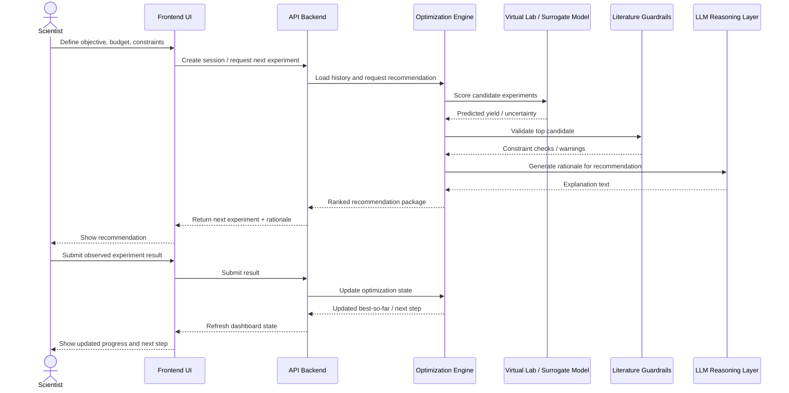

# **PRD: LabPilot**

## **1. Summary**

LabPilot is an AI copilot for experiment optimization in R&D labs. It helps scientists decide which experiment to run next based on prior experimental results, literature constraints, and an adaptive optimization engine. The immediate hackathon version focuses on reaction optimization using a real-world benchmark dataset and a virtual lab built from a surrogate model. The product is not “RL for chemistry” as a science project. The product is a decision-support workflow for scientists: define objective, review prior runs, get the next experiment recommendation, run it, update the model, repeat.

The core value proposition is simple: reduce the number of experiments needed to reach a good operating point.

## **2. Problem**

Experimental optimization in pharma, chemistry, and process R&D is expensive and slow. Scientists often tune variables like catalyst, solvent, ligand, temperature, concentration, or reaction time across a large combinatorial space. Most teams still rely on intuition, spreadsheets, and static DOE methods. These approaches are hard to scale, make weak use of historical data, and often waste runs on uninformative experiments.

The recurring user question is: given everything we have already tried, what should we run next?

That is the product problem. Not “can AI understand chemistry,” but “can AI improve experimental decision-making under budget constraints.”

## **3. Users**

Primary users are medicinal chemists, process development scientists, synthetic chemists, and R&D engineers running iterative optimization campaigns. In a real SaaS setting, the buyer could be a lab manager, head of process development, or platform informatics lead. For the hackathon, the user persona is a scientist with historical experiment data who wants to optimize yield under limited budget.

## **4. Goals**

The product should do four things well.

First, ingest historical experiment data in a structured form.

Second, recommend the next experiment to run given an objective and a budget.

Third, make the recommendation credible by grounding it in both observed data and literature constraints.

Fourth, show that the recommendation strategy finds better conditions faster than simple baselines such as random search.

For the hackathon, success is not full scientific validity. Success is a credible product loop with real data, measurable improvement, and a live demo that is easy to understand.

## **5. Non-goals**

LabPilot is not trying to discover new molecules, predict full reaction mechanisms, or replace chemists. It is not a generic chatbot for chemistry papers. It is not a pure RL research benchmark. It is not a robotics project in the MVP. The first version is strictly focused on experiment recommendation for optimization workflows.

## **6. Core user story**

A scientist uploads historical experiment data or selects a built-in benchmark dataset. They define an objective such as maximizing yield while keeping impurity or cost within bounds. The system analyzes prior runs, retrieves relevant literature constraints, and recommends the next experiment. The scientist reviews the recommendation, runs the experiment in the real world or simulation, uploads the result, and the system updates its strategy. This repeats until the budget is exhausted or the target is met.

That loop is the product.

## **7. Product scope for the hackathon**

The MVP should feel like a thin SaaS application, not a notebook. The workflow should be:

Upload dataset or choose a benchmark reaction dataset.

Define optimization objective and budget.

Run an adaptive optimization session.

See the next recommended experiment and rationale.

Compare the strategy against baselines.

Review a progress dashboard showing best yield over time.

That is enough. Do not overbuild.

## **8. Data strategy**

This product should use a real-world dataset. Synthetic-only environments will undermine credibility. The right move is to start from a known benchmark dataset used in reaction optimization work. A Suzuki-Miyaura reaction optimization dataset is a strong candidate because it is structured, widely used, and small enough to move quickly on. Buchwald-Hartwig or a curated subset of Open Reaction Database is also viable.

The product does not need to claim experimental truth beyond the dataset. The story is: we use real historical reaction data to build a virtual lab for recommendation and evaluation.

The dataset should include a set of controllable features and at least one optimization target, ideally yield. If impurity or cost are unavailable, the MVP can optimize yield only and frame constraints as parameter range guardrails.

## **9. Virtual lab design**

The dataset alone is not enough because an optimization engine needs an environment that can respond to proposed experiments. The product therefore trains a surrogate model that predicts outcome from conditions. That surrogate model acts as the virtual lab.

Input: reaction conditions such as catalyst, ligand, solvent, base, temperature, and time.

Output: predicted yield.

This is standard and defensible. It is not fake data generation out of nowhere. It is model-based simulation grounded in real observed data.

For the MVP, a gradient-boosted tree model, random forest, or Gaussian process is sufficient. The choice should prioritize speed and stability over sophistication.

## **10. Optimization engine**

The optimizer is the decision engine that chooses the next experiment under a limited budget. For the hackathon, do not lead with RL unless you have time. Use something sample-efficient and credible.

Recommended order:

random search as baseline,

Bayesian optimization or bandit-style selection as the main adaptive method,

optional RL framing as future roadmap or secondary comparison.

This is the right product call because the user cares about recommendation quality, not algorithm branding. If you later want to position RL, do it where sequential state dynamics matter more strongly, such as multi-step process control or robotic lab execution.

## **11. Role of the LLM**

The LLM should not be the optimizer. That would make the system look hand-wavy. The LLM should sit above the optimizer as a reasoning and explanation layer.

It should do three things:

summarize observed patterns from prior runs,

generate or refine candidate experiments,

integrate literature-based guardrails and explain recommendations.

Example: “Prior runs suggest the best region is around moderate temperature and solvent B. The optimizer recommends exploring catalyst loading near the current optimum because uncertainty remains high there.”

That makes the system legible to users and helps the demo.

## **12. Literature intelligence**

The literature layer is useful, but it must be subordinate to the core loop. This is not a RAG product. Literature retrieval should be used to validate parameter ranges, identify common conditions, or flag obviously unrealistic recommendations.

Example use: if the optimizer proposes a temperature or solvent combination that is rarely used or unstable in similar reactions, the literature layer can warn or down-rank it.

This is where Tavily fits naturally. It adds credibility without turning the product into “chat with papers.”

## **13. User experience**

The UI should be compact and product-shaped. Three panels are enough.

The setup panel lets the user choose dataset, define target metric, and set budget.

The recommendation panel shows the next proposed experiment, expected yield, and rationale.

The progress panel shows experiment history, best-so-far yield, and a comparison chart versus baseline methods.

That is the minimum product surface that looks like software someone could plausibly buy.

## **14. Functional requirements**

The system must allow the user to load a reaction dataset and inspect available variables.

The system must allow the user to set an objective, at minimum maximize yield.

The system must train or load a surrogate model over the observed experiment space.

The system must run at least two strategies: random baseline and one adaptive optimizer.

The system must produce ranked experiment recommendations.

The system must display optimization progress across experiment budget.

The system should optionally retrieve literature context and display simple guardrails.

The system should expose clear rationale for the current recommendation.

## **15. Metrics**

The main metric is best yield found as a function of experiment count. This is the clearest way to show search efficiency.

Secondary metrics:

time to reach a target yield threshold,

improvement over random baseline,

stability of recommendations across runs.

For the product story, the core claim is that LabPilot reaches high-performing conditions in fewer experiments.

## **16. Architecture**

Frontend should be a lightweight web app. Next.js or React is fine if your team can move quickly. Do not overengineer. A basic layout with charts and a recommendations table is enough.

Backend should be Python, likely FastAPI. It should expose endpoints for dataset loading, optimization session creation, next-experiment recommendation, and results update.

The modeling layer should include a preprocessing pipeline for categorical and numeric features, a surrogate model, and an optimizer.

The LLM layer should call Nebius Token Factory to generate explanations and optionally candidate experiment proposals.

The retrieval layer should use Tavily for lightweight literature lookup.

Nebius compute should be used for model training, simulation loops, or evaluation runs, so sponsor usage is explicit and legitimate.

## **17. API sketch**

At minimum, the backend needs:

a session creation endpoint,

an endpoint to request the next experiment,

an endpoint to submit experiment outcome,

an endpoint to fetch dashboard state.

That is enough to support the full loop.

## **18. Demo flow**

The demo should start with a simple framing: scientists waste time deciding what to try next, and LabPilot helps reduce that search cost.

Then load a real reaction dataset.

Define an objective: maximize yield within a 20-experiment budget.

Run random search and adaptive optimization side by side.

Show that LabPilot recommends the next experiment, explains why, and converges to a better region faster.

Optionally show literature guardrails that influence recommendation quality.

The demo should end with a chart: best yield over number of experiments, with LabPilot outperforming baseline.

That is a strong, memorable story.

## **19. Why this is a good hackathon project**

It maps to the theme well because it is clearly agentic: the system reasons over prior context, uses tools, plans a next action, and updates after feedback.

It uses sponsor tools in a meaningful way: Nebius for inference and compute, Tavily for retrieval.

It is grounded in real data.

It looks like a real SaaS product rather than a research notebook.

And it can be built in a constrained time window if the scope stays tight.

## **20. Risks and mitigation**

The biggest risk is getting stuck on chemistry or dataset wrangling. Mitigation: use a known structured benchmark and simplify the objective to yield.

The second risk is overinvesting in RL. Mitigation: use Bayesian optimization or bandits for MVP and only mention RL as an extension.

The third risk is building too much UI and too little working intelligence. Mitigation: keep the UI thin and invest in the recommendation loop first.

The fourth risk is making the product feel like a paper search tool. Mitigation: keep literature retrieval as a guardrail, not the centerpiece.

## **21. Roadmap beyond MVP**

After the hackathon, the product could expand into ELN integrations, richer constraints, multi-objective optimization, automated experiment scheduling, wet-lab robotics integration, and support for proprietary customer datasets.

That is a credible expansion path, but not part of the initial build.

## **22. Recommendation**

Build LabPilot as an experiment recommendation product. Use a real reaction optimization dataset. Train a surrogate model as the virtual lab. Use a sample-efficient adaptive optimizer. Put an LLM on top for reasoning and literature-aware explanation. Package it as a SaaS workflow with a compact dashboard.

That is the right balance of product credibility, technical honesty, and hackathon viability.

## **23. Architecture diagrams**

### **System architecture**

```
┌─────────────────────────────────────────────────────────────────────┐
│                            LabPilot UI                             │
│  - Dataset selection / upload                                      │
│  - Objective + budget setup                                        │
│  - Next experiment recommendation                                  │
│  - Progress charts / experiment history                            │
└───────────────────────────────┬─────────────────────────────────────┘
                                │
                                ▼
┌─────────────────────────────────────────────────────────────────────┐
│                           API Backend                              │
│  FastAPI / Python orchestration layer                              │
│  - Session management                                              │
│  - Optimization run control                                        │
│  - Result ingestion                                                │
│  - Dashboard state                                                 │
└───────────────┬───────────────────────┬─────────────────────────────┘
                │                       │
                │                       │
                ▼                       ▼
┌──────────────────────────────┐   ┌──────────────────────────────────┐
│     Optimization Engine      │   │      AI Reasoning Layer         │
│  - Random baseline           │   │  Nebius Token Factory LLM       │
│  - Bayesian optimization     │   │  - summarize patterns           │
│  - Bandit / optional RL      │   │  - explain recommendation       │
│  - candidate ranking         │   │  - refine candidate experiments │
└───────────────┬──────────────┘   └───────────────┬──────────────────┘
                │                                  │
                ▼                                  ▼
┌──────────────────────────────┐   ┌──────────────────────────────────┐
│       Virtual Lab Layer      │   │      Literature / Guardrails    │
│  Surrogate model over real   │   │  Tavily + retrieval logic       │
│  reaction dataset            │   │  - reaction constraints         │
│  - predicts yield            │   │  - common operating ranges      │
│  - simulates experiment      │   │  - warning / down-rank signals  │
└───────────────┬──────────────┘   └──────────────────────────────────┘
                │
                ▼
┌─────────────────────────────────────────────────────────────────────┐
│                            Data Layer                              │
│  - Real-world reaction dataset                                     │
│  - Feature preprocessing                                           │
│  - Model training / evaluation on Nebius compute                   │
└─────────────────────────────────────────────────────────────────────┘
```

### **Core recommendation loop**

```
User defines objective + budget
            │
            ▼
Load historical experiment data
            │
            ▼
Train / load surrogate model
            │
            ▼
Optimizer proposes next experiment
            │
            ▼
LLM explains / refines recommendation
            │
            ▼
Literature layer validates constraints
            │
            ▼
Run experiment in virtual lab
            │
            ▼
Record outcome
            │
            ▼
Update model state and repeat until budget exhausted
```

### **Data flow diagram**

```
Real reaction dataset
      │
      ▼
Feature engineering / preprocessing
      │
      ▼
Surrogate model training
      │
      ▼
Virtual lab inference endpoint
      │
      ├──────────────► returns predicted yield / score
      │
      ▼
Optimization engine selects candidate experiment
      │
      ▼
LLM generates rationale + user-facing explanation
      │
      ▼
Frontend dashboard displays recommendation + charts
```

### **API interaction diagram**

```
[Frontend]
   │
   ├── POST /session/create ───────────────► create optimization session
   │
   ├── POST /session/next-experiment ─────► get ranked recommendation
   │
   ├── POST /session/submit-result ───────► submit observed / simulated outcome
   │
   └── GET  /session/state ───────────────► fetch dashboard state, charts, history
```

### **Hackathon deployment view**

```
┌───────────────────────────────┐
│ Frontend (Next.js / React)    │
│ Hosted web app                │
└───────────────┬───────────────┘
                │ HTTPS
                ▼
┌───────────────────────────────┐
│ Backend API (FastAPI)         │
│ Session + orchestration       │
└───────┬───────────────┬───────┘
        │               │
        │               ├──────────────► Nebius Token Factory
        │               │                LLM reasoning / explanation
        │               │
        │               └──────────────► Tavily
        │                                literature constraints
        │
        └──────────────────────────────► Model runtime / Nebius compute
                                         surrogate model + optimization loop
```

### **What to show in the live demo**

```
1. Choose reaction dataset
2. Set objective: maximize yield in 20 experiments
3. Show baseline vs LabPilot optimization run
4. Surface next recommended experiment
5. Show rationale from LLM
6. Show best-yield-vs-experiment chart
7. End on clear uplift over baseline
```

### **Sequence diagram: one optimization cycle**

```
Scientist / User
    │
    │ 1. Define objective, budget, constraints
    ▼
Frontend UI
    │
    │ 2. POST /session/create or /session/next-experiment
    ▼
API Backend
    │
    │ 3. Load session state and prior experiment history
    ▼
Optimization Engine
    │
    │ 4. Generate candidate experiments
    │    - exploit promising regions
    │    - explore uncertain regions
    ▼
Virtual Lab / Surrogate Model
    │
    │ 5. Score candidate experiments
    │    - predicted yield
    │    - uncertainty / expected improvement
    ▼
Optimization Engine
    │
    │ 6. Rank candidates and select top recommendation
    ▼
Literature / Guardrails Layer
    │
    │ 7. Validate recommendation against literature constraints
    │    - common operating ranges
    │    - implausible combinations
    ▼
LLM Reasoning Layer
    │
    │ 8. Generate explanation
    │    - why this experiment
    │    - what pattern was observed
    │    - what tradeoff is being explored
    ▼
API Backend
    │
    │ 9. Return recommendation package
    │    - experiment parameters
    │    - expected score
    │    - rationale
    ▼
Frontend UI
    │
    │ 10. Display next experiment recommendation
    ▼
Scientist / User
    │
    │ 11. Run experiment in lab or simulated mode
    │
    │ 12. Submit result
    ▼
Frontend UI
    │
    │ 13. POST /session/submit-result
    ▼
API Backend
    │
    │ 14. Persist observed result
    │ 15. Update experiment history
    ▼
Optimization Engine
    │
    │ 16. Update search state / posterior / bandit state
    ▼
Frontend UI
    │
    │ 17. Refresh dashboard
    │    - best yield so far
    │    - experiment history
    │    - next recommendation ready
    ▼
Scientist / User
```

### **Sequence diagram: Mermaid version**



### **Component ownership notes**

```
Optimization engine:
- owns recommendation quality
- selects next experiment under budget

Virtual lab / surrogate model:
- owns predicted outcomes
- simulates experiment response surface

LLM reasoning layer:
- owns explanation
- summarizes patterns and tradeoffs
- optionally refines candidate experiments

Literature guardrails:
- owns plausibility checks
- flags unrealistic or weakly supported recommendations

API backend:
- owns orchestration and session state

Frontend UI:
- owns workflow presentation and user control
```